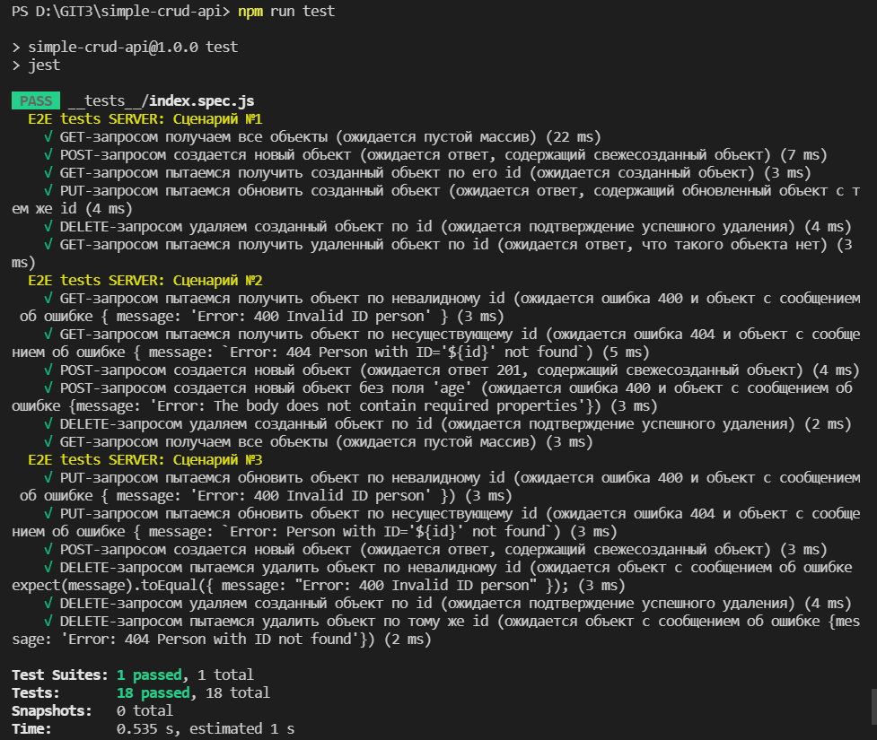

## Инструкция работы с приложением

Перед началом необходимо:

- `git clone https://github.com/Maks-T/simple-crud-api.git` - клонируйть репозиторий ;
- `cd simple-crud-api` - перейти в директорию;
- `git checkout dev` - выбирите ветку `dev`;
- `npm i` - установите зависимости;

1. Команды для запуска приложения:

   - `"npm run start:dev"` - Приложение запускается в development-режиме при помощи nodemon;
   - `"npm run start:prod"` - Приложение запускается в production-режиме при помощи webpack;
   - `"npm run build:dev"` - Приложение собирается в production-режиме при помощи webpack;
   - `"npm run build:prod"` - Приложение собирается в production-режиме при помощи webpack;

2. Сервер возвращает соответствующие ответы на запросы:

- **GET** `http://127.0.0.1:3000/person` (запрос `../person/` будет выбрасывать ошибку):
  - Сервер возвращает статус код 200 и все записи:
  ```javascript
  [
    {
      id: "dc375068-4ae6-11ec-81d3-0242ac130003",
      name: "Maxim",
      age: 32,
      hobbies: ["programming", "reading", "science"],
    },
    {
      id: "dc375068-4ae6-11ec-81d3-0242ac130001",
      name: "Karina",
      age: 32,
      hobbies: ["fish", "cook", "movies"],
    },
  ];
  ```
- **GET** `http://127.0.0.1:3000/person/{personId}`:

  - Сервер возвращает статус код 200 и запись с `id === personId`, если такая запись есть
    Пример:

  ```javascript
    {
      "id": "dc375068-4ae6-11ec-81d3-0242ac130003",
      "name": "Maxim",
      "age": 32,
      "hobbies": ["programming", "reading", "science"]
    }
  ```

  - Сервер возвращает статус код 400 и соответствующее сообщение, если `personId` невалиден (не `uuid`):

  ```javascript
    {
       "message": "Error: 400 Invalid ID person"
    }
  ```

  - Сервер возвращает статус код 404 и соответствующее сообщение, если запись с `id === personId` не найдена:

  ```javascript
    {
       "message": "Error: Person 404 with ID='ac375068-4ae6-11ec-81d3-0242ac130002' not found"
    }
  ```

- **POST** `http://127.0.0.1:3000/person`

  - Необходимо передать тело объекта `person` с обязательными полями:

  ```javascript
    {
      "name": "Maxim",
      "age": 32,
      "hobbies": ["programming", "reading", "science"]
    }
  ```

  - Сервер возвращает статус код 201 и свежесозданную запись:

  ```javascript
    {
      "id": "dc375068-4ae6-11ec-81d3-0242ac130003",
      "name": "Maxim",
      "age": 32,
      "hobbies": ["programming", "reading", "science"]
    }
  ```

  - Сервер возвращает статус код 400 и соответствующее сообщение, если тело запроса не содержит обязательных полей:

  ```javascript
    {
       "message": "Error: 400 The body does not contain required properties"
    }
  ```

- **PUT** `http://127.0.0.1:3000/person/{personId}`

  - Необходимо передать тело Обновленного объекта `person` с обязательными полями:

  ```javascript
    {
      "name": "MAXIMUS",
      "age": 33,
      "hobbies": ["node", "angular", "javascript"]
    }
  ```

  - Сервер возвращает статус код 200 и обновленную запись:

  ```javascript
    {
      "id": "dc375068-4ae6-11ec-81d3-0242ac130003",
      "name": "MAXIMUS",
      "age": 33,
      "hobbies": ["node", "angular", "javascript"]
    }
  ```

  - Сервер возвращает статус код 400 и соответствующее сообщение, если `personId` невалиден (не `uuid`):

  ```javascript
   {
      "message": "Error: 400 Invalid ID person"
   }
  ```

  - Сервер возвращает статус код 400 и соответствующее сообщение, если обновленное тело объекта `person` не имеет обязательных полей или если его поля невалидны:

  ```javascript
   {
      "message": "Error: 400 The body does not contain required properties"
   }
  ```

  - Сервер возвращает статус код 404 и соответствующее сообщение, если запись с `id === personId` не найдена:

  ```javascript
   {
      "message": "Error: 400 Invalid ID person"
   }
  ```

- **DELETE** `http://127.0.0.1:3000/person/{personId}`

  - Сервер возвращает статус код 204 если запись найдена и удалена
  - Сервер возвращает статус код 400 и соответствующее сообщение, если `personId` невалиден (не `uuid`):

    ```javascript
    {
      "message": "Error: 400 Invalid ID person"
    }
    ```

  - Сервер возвращает статус код 404 и соответствующее сообщение, если запись с `id === personId` не найдена:

  ```javascript
    {
      "message": "Error: 404 Person with ID='e7ecdd91-a9e1-4aac-975f-c8206d318199' not found"
    }
  ```

- **GET**, **POST**, **PUT**, **DELETE** `http://127.0.0.1:3000/person/some/resource`

  - Сервер возвращает статус код 404 и соответствующее сообщение, если такого ресурса не существует

  ```javascript
    {
      "message": "Error: 404 Invalid Request! The resource '/person/some/resource'  does not exist"
    }
  ```

- **POST**, **PUT** `http://127.0.0.1:3000/person/{personId}`
  - Сервер возвращает статус код 500 и соответствующее сообщение, если тело объекта имеет ошибки синтаксиса
  ```javascript
    {
      "message": "Error: 500 Internal Server Error"
    }
  ```

3. Для запуска 2E2 тестирования:

- `"npm run test"`


